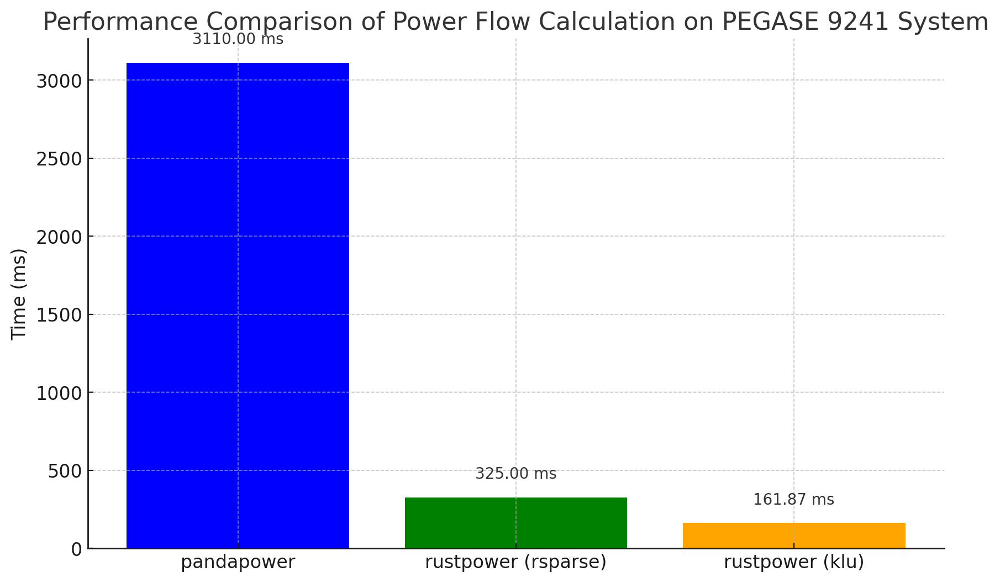
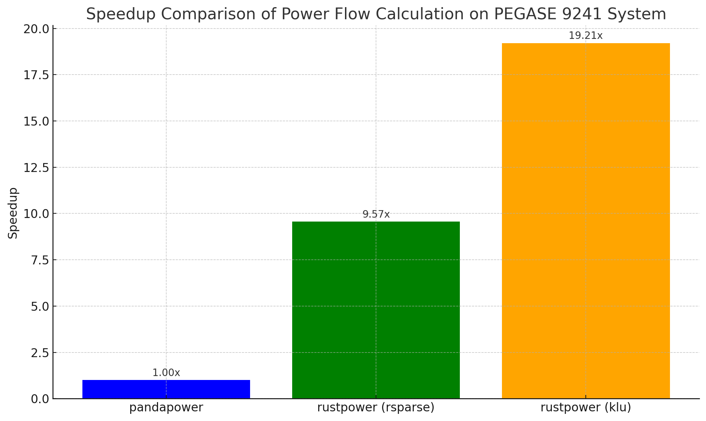

# RustPower

RustPower is a power flow calculation library written in Rust, designed to perform steady-state analysis on electrical power systems.

## Current Features

- Calculation of nodal admittance matrix (Ybus)
- Nodal power injection vector calculation (Sbus)
- Power flow analysis using Newton-Raphson method
- Supports for pandapower network Json files via Serde (todo:CSV parsing)
- Handles external grid nodes and transformer elements
- RSparse and KLU solver* (preferred but optional )

\* Need to set "SUITESPARSE_DIR" to the installed folder on Windows. The KLU feature is disabled by default.

## Comparison with Existing Tools 

PyPower and PandaPower: These tools use traditional ways to build admittance matrices. They perform dynamic slicing in each iteration to extract vectors and matrices for PQ and PV nodes. While this approach is general, it can lead to performance bottlenecks when dealing with large-scale power systems.

This Program: By using some simple linear algebra methods, this program constructs the required vectors and matrices during initialization, avoiding the need for dynamic slicing of PV, PQ, Ext nodes in each iteration. Based on experience with real-time EMT simulation, I believe it will never become necessary to check individual column in the jacobian matrix during its construction. This not only simplifies the code logic but also significantly improves computational efficiency beyond the benefits brought by Rust and KLU.
Currently, on IEEE 39-Bus system, this program takes around 300 microseconds (with KLU) and 500 microseconds (with RSparse solver) to finish 3 iterations, which is 10 times faster than Python and Numba-based implementation.

In performance tests on the PEGASE 9241 system, the Rust implementation for power flow calculation demonstrated significant performance advantages. Despite pandapower using acceleration techniques, the Rust implementation achieved far superior speeds although the post solution is not included.




## Installation

Add this library to your `Cargo.toml` file:

```toml
[dependencies]
RustPower = "0.1.0"
```

## Usage

```Rust
use rustpower::{io::pandapower::Network, prelude::*};
fn main() {
    // Define your power flow network or load pandapower files
    let dir = "{your file path}/file_name.zip";
    let net : Network = load_csv_zip(dir).unwrap(); //can load a zip archive or folder with csvs
    let pf = PFNetwork::from(net);
    let v_init = pf.create_v_init();
    let tol = Some(1e-8);
    let max_it = Some(10);

    let (v,iterations) = pf.run_pf(v_init.clone(), max_it, tol);
    //display results
    println!("Vm,\t angle"); 
    for (x, i) in v.iter().enumerate() {
        println!("{} {:.5}, {:.5}", x, i.modulus(), i.argument().to_degrees());
    }
}
```
The cases are generated from pandapower with customized python functions, see the python notebook in the `cases` folder for details.

## License

This project is licensed under the MPLv2 License - see the LICENSE file for details.

## Contributions

Contributions are welcome! Feel free to open an issue or submit a pull request.

## Authors

- Tianshi Cheng
## Contact

Feel free to open a issue or PR.

## Acknowledgements

This project draws inspiration and knowledge from the following libraries:

- [Pandapower](https://github.com/e2nIEE/pandapower): An easy-to-use Python package for power system analysis.
- [PyPower](/https://github.com/rwl/PYPOWER): A Python implementation of the power flow analysis tool MatPower.
- [MatPower](https://matpower.org/): A package of MATLAB-based power system simulation, analysis, and optimization tools.

In addition, it uses part of the design philosophy and theory in:
[T. Cheng, T. Duan and V. Dinavahi, "ECS-Grid: Data-Oriented Real-Time Simulation Platform for Cyber-Physical Power Systems," in IEEE Transactions on Industrial Informatics, vol. 19, no. 11, pp. 11128-11138, Nov. 2023, doi: 10.1109/TII.2023.3244329.](https://era.library.ualberta.ca/items/5e45c2ff-9b92-41c7-b685-020110b77239)

Although ECS-Grid is a more complex electromagnetic transient (EMT) cyber-physical simulation system, it provided valuable insights and experience that contributed to the design of this steady-state power flow calculation software.
